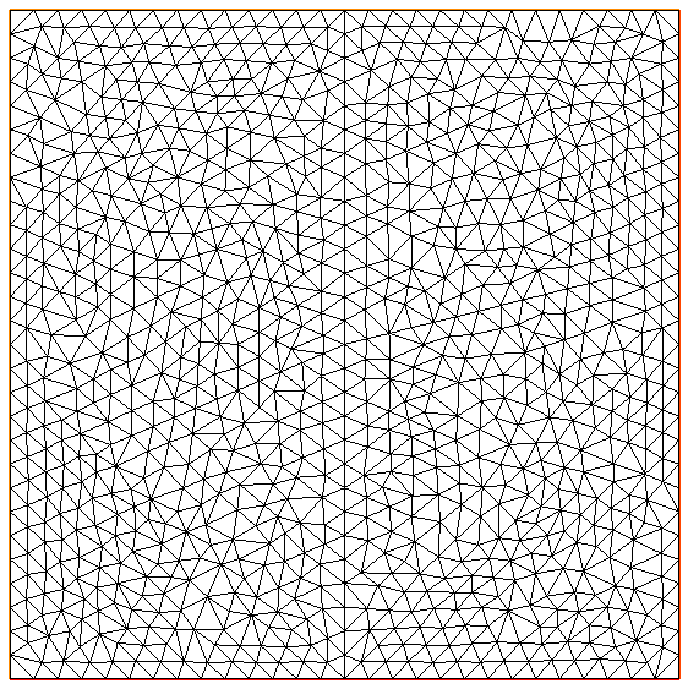
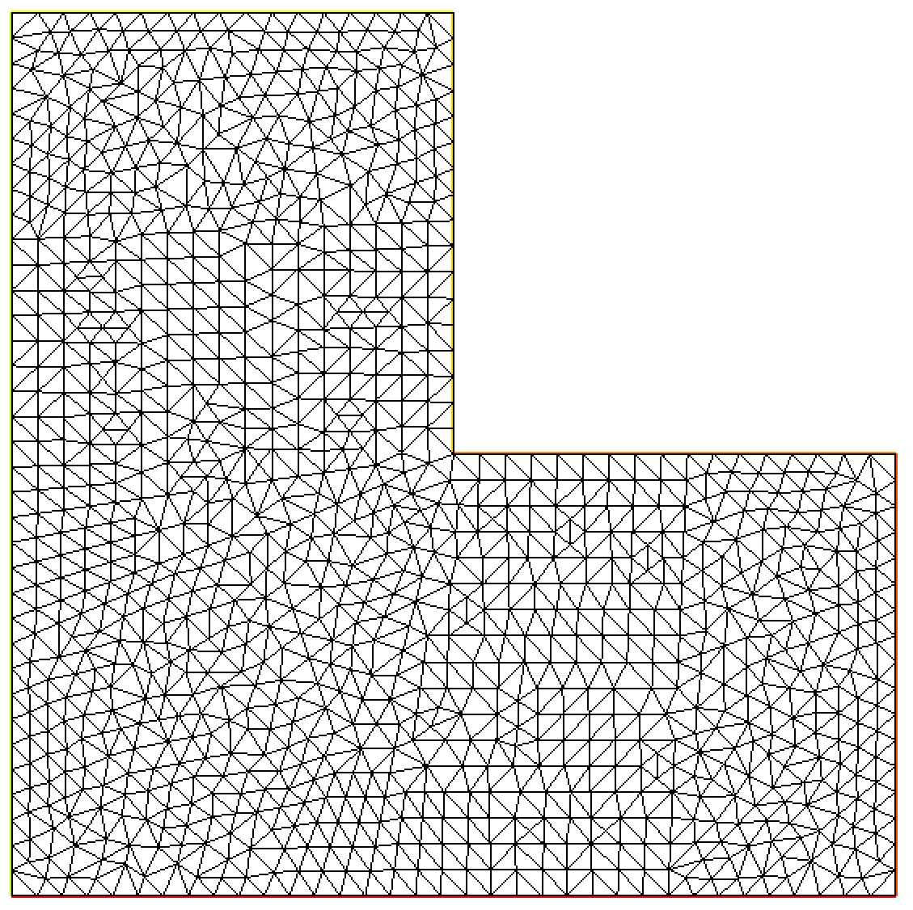

# PSTV (2D Triangulation Validator)
# Polygonal Sequence-driven Triangulation Validator: An Incremental Approach to 2D Triangulation Verification

**Authors:** Sora Sawai, [Kazuaki Tanaka](https://sites.google.com/site/kazuakitanaka0203/), [Katsuhisa Ozaki](https://www.mathsci.shibaura-it.ac.jp/ozaki/intro.html), [Shin'ichi Oishi](http://www.oishi.info.waseda.ac.jp/)

Polygonal Sequence-driven Triangulation Validator (PSTV) is an algorithm to ensure the correctness of 2D Delaunay triangulation. It can be easily utilized by installing the C++ header files.


## Features

- PSTV: An algorithm addressing rounding errors in 2D Delaunay triangulation.

- Unique use of floating-point filters over interval arithmetic for efficiency.

- Ensures a posteriori triangulation accuracy and the Delaunay property.

- Method for detecting incorrect triangulations generated by existing software.

- Emphasis on FEM implications of triangulation errors.

## Installation

### Step0: clone this repository

```bash
git clone https://github.com/uchunanora/2d-triangulation-validator
```

### Step1: Install GMP (GNU Multi-Precision)

Ubuntu

```bash
sudo apt-get update
sudo apt-get install libgmp-dev
```

Windows (Cygwin)

Install libgmp-devel and its dependencies.

details: https://gmplib.org/

## Quick Start

You can try PSTV in [`examples`](./examples/) directory.


## Usage Example

### Create Dataset

<table>
<tr>
<td></td>
<td></td>
</tr>
</table>

Create a dataset representing the triangulation using existing software, such as FreeFEM, MATLAB, Gmsh, CGAL, etc. The dataset representing triangulation includes the following three components:

1. **Vertex Data**
    
    - An array of X and Y coordinates of all nodes constituting the triangulation.

2. **Triangle Data**

    - An array of indices for the 3 nodes constituting each triangle.

3. **Boundary Data**

    - Clockwise array of indices representing the nodes on the boundary.

Adjust the dataset to conform to the following template format:

Vertex Data
```bash
# X, Y
-0.99999, 1
-0.92857, 1
-0.99999, 0.928571
...
0.928572,-1
1.000000,-0.9285714
1.000000,-1
```

Triangle Data
```bash
# Index1, Index2, Index3
1, 0, 2
2, 3, 6
6, 5, 2
...
168, 137, 167
138, 109, 137
117, 132, 149
```

Boundary Data
```bash
# Index
0
2
3
...
989
994
997
```
### Validate Dataset

## Demo Application

## Acknowledgements
